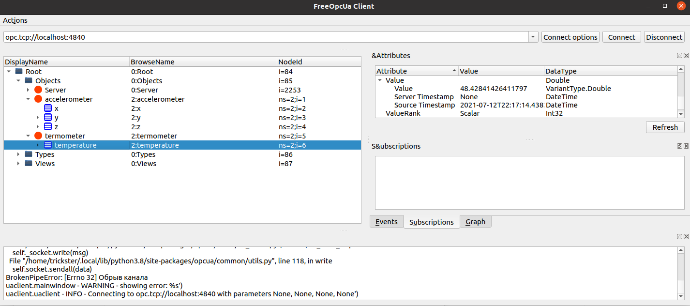
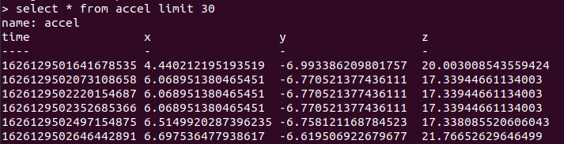
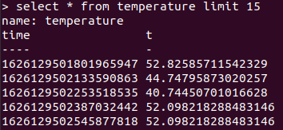
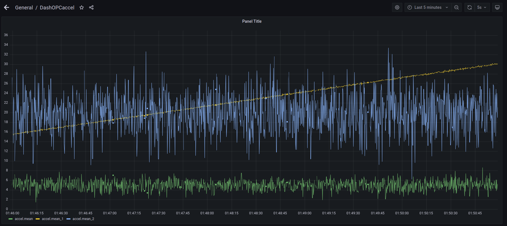
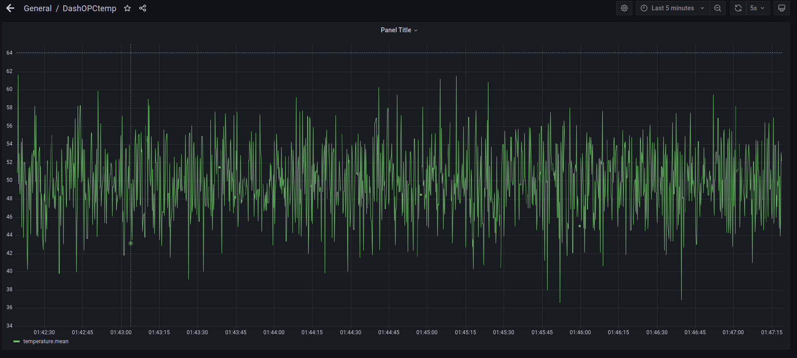

# Kafka-Opc converter

Проект представляет из себя конвертер сообщений Kafka в формат OPC UA вместе с некоторой демонстрационной инфраструктурой

## Архитектура

- эмулятор датчиков + kafka producer (measures.py)

- Kafka broker

- конвертер + opc server (converter.py)

- opc client + influxDB client (client.py)

- influxDB

- Grafana

  
## Скриншоты

Узлы opc-сервера в окне программы opc-client

Показания акселерометра в influxDB

Показания термометра в influxDB

Показания акселерометра в Grafana

Показания термометра в Grafana

## Общий порядок установки

- установить необходимые библиотеки через pip
- запустить сервисы kafka, indluxDB и grafana с настройками по умолчанию
- запустить measures.py, converter.py, client.py
- настроить Grafana
